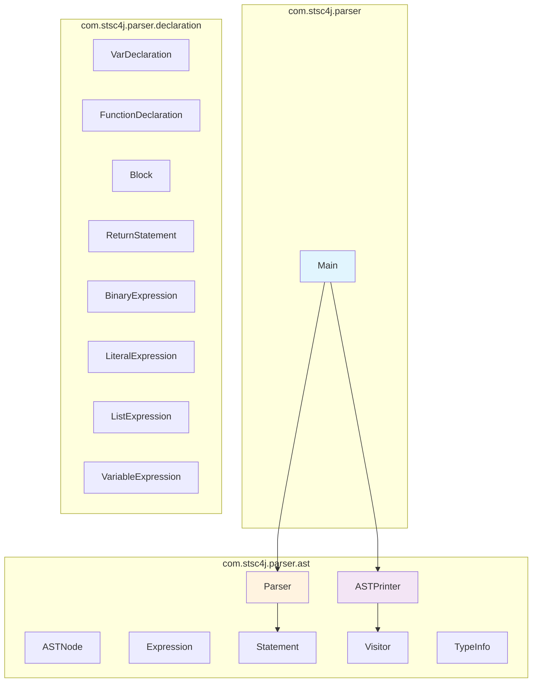
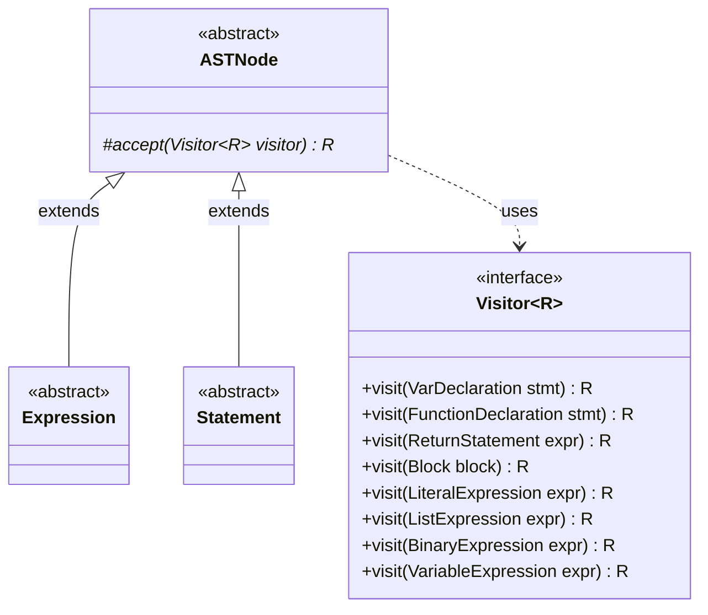
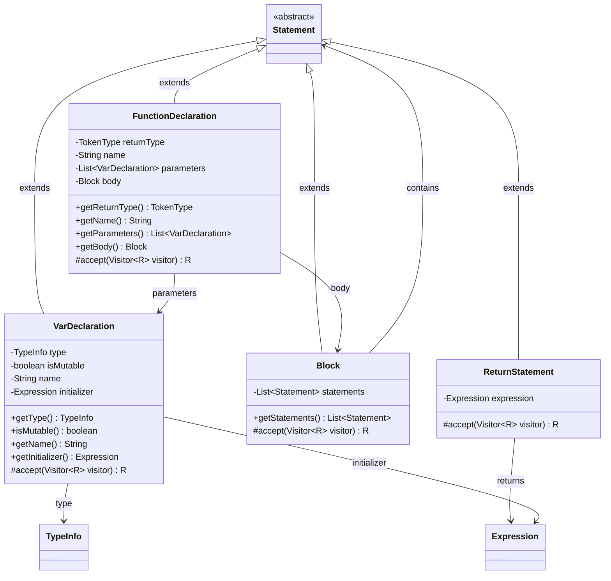
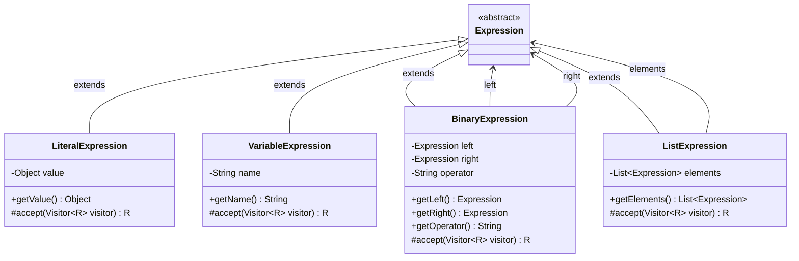
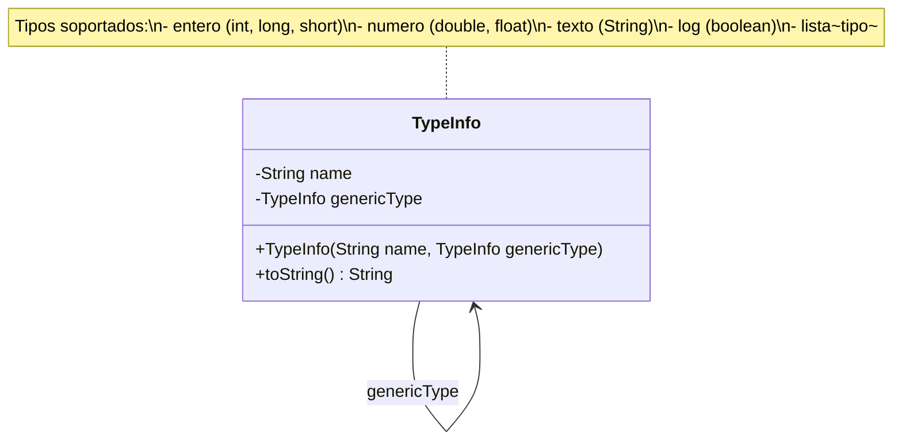
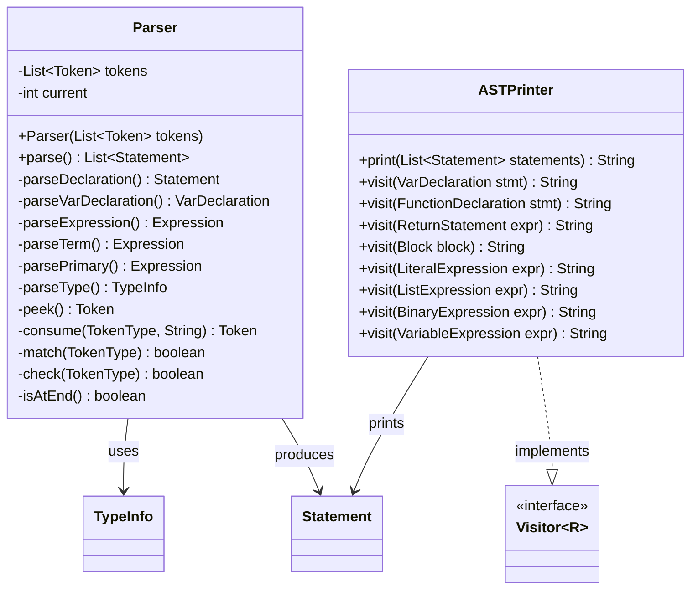
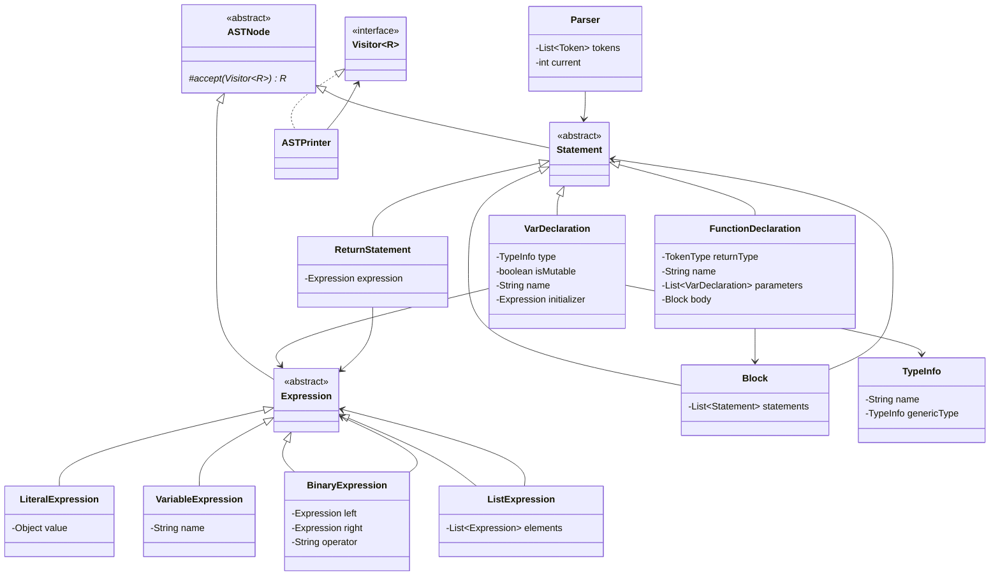

# 🦅 Quetzal STSC4J Parser

<div align="center">


**Librería nativa Java para análisis sintáctico (Parser) del lenguaje Quetzal**

[Características](#-características) •
[Arquitectura](#-arquitectura) •
[Instalación](#-instalación) •
[Uso](#-uso) •
[Contribución](#-contribución)

</div>

---

## 📋 Descripción

**Quetzal STSC4J Parser** es un módulo del compilador Quetzal encargado del **análisis sintáctico** (parsing). Transforma una secuencia de tokens generados por el lexer en un **Árbol de Sintaxis Abstracta (AST)**, permitiendo el análisis semántico y la generación de código posteriores.

El parser implementa el patrón de diseño **Visitor** para recorrer y procesar el AST de manera extensible y mantenible.

---

## ✨ Características

- 🌳 **Generación de AST** - Construcción de árbol de sintaxis abstracta tipado
- 🔄 **Patrón Visitor** - Arquitectura extensible para procesar nodos del AST
- 📝 **Soporte de tipos** - Manejo de tipos primitivos y genéricos (`lista<entero>`)
- 🎯 **Variables mutables/inmutables** - Distinción entre variables modificables y constantes
- 🧩 **Expresiones binarias** - Soporte para operaciones aritméticas y lógicas
- 📊 **AST Printer** - Visualización del árbol para debugging

---

## 🏗 Arquitectura

El proyecto sigue una arquitectura modular basada en el patrón **Abstract Syntax Tree (AST)** con el patrón **Visitor** para el recorrido del árbol.

### Diagrama General de Paquetes



---

## 📊 Diagramas de Clases

### 1. Jerarquía Principal del AST

Este diagrama muestra la estructura de herencia fundamental del árbol de sintaxis abstracta.



#### Descripción de Clases Base

| Clase | Tipo | Descripción |
|-------|------|-------------|
| `ASTNode` | Abstract | Clase raíz de todos los nodos del AST. Define el método `accept()` para el patrón Visitor. |
| `Expression` | Abstract | Representa expresiones que producen un valor (literales, operaciones, variables). |
| `Statement` | Abstract | Representa sentencias que ejecutan acciones (declaraciones, bloques, retornos). |
| `Visitor<R>` | Interface | Define operaciones de visita para cada tipo de nodo. Parámetro `R` para tipo de retorno. |

---

### 2. Sentencias (Statements)

Las sentencias representan acciones o declaraciones en el código fuente.



#### Descripción de Sentencias

| Clase | Responsabilidad |
|-------|-----------------|
| `VarDeclaration` | Declaración de variables con tipo, mutabilidad, nombre y valor inicial. Soporta la sintaxis `entero var x = 10`. |
| `FunctionDeclaration` | Declaración de funciones con tipo de retorno, parámetros y cuerpo. Encapsula la definición completa de una función. |
| `Block` | Bloque de código conteniendo múltiples sentencias. Representa el cuerpo de funciones, ciclos y condicionales. |
| `ReturnStatement` | Sentencia de retorno con expresión opcional. Indica el valor de retorno de una función. |

---

### 3. Expresiones (Expressions)

Las expresiones producen valores y pueden anidarse para formar expresiones complejas.



#### Descripción de Expresiones

| Clase | Responsabilidad |
|-------|-----------------|
| `LiteralExpression` | Valores literales: números (`10`, `3.14`), cadenas (`"hola"`), booleanos (`true`, `false`). |
| `VariableExpression` | Referencias a variables por nombre. Permite acceder al valor de variables declaradas. |
| `BinaryExpression` | Operaciones binarias como suma, resta, comparaciones. Contiene operador y dos operandos. |
| `ListExpression` | Expresión de lista literal `[1, 2, 3]`. Contiene una lista de expresiones como elementos. |

---

### 4. Sistema de Tipos

El sistema de tipos soporta tipos primitivos y tipos genéricos (como listas tipadas).



#### Tipos Primitivos Soportados

| Tipo Quetzal | Tipos Java Mapeados | Descripción |
|--------------|---------------------|-------------|
| `entero` | `int`, `long`, `short` | Números enteros |
| `numero` | `double`, `float` | Números decimales |
| `texto` | `String` | Cadenas de texto |
| `log` | `boolean` | Valores lógicos |
| `lista<T>` | Genérico | Lista tipada de elementos |

---

### 5. Parser y ASTPrinter

Componentes principales para la construcción y visualización del AST.



#### Descripción de Componentes

| Clase | Responsabilidad |
|-------|-----------------|
| `Parser` | Analizador sintáctico descendente recursivo. Consume tokens y construye el AST. Implementa gramática del lenguaje Quetzal. |
| `ASTPrinter` | Implementación del Visitor para serializar el AST a formato texto legible. Útil para debugging y visualización. |

---

### 6. Diagrama Completo de Clases



---

## 🚀 Instalación

### Prerrequisitos

- **Java 11** o superior
- **Maven 3.x**

### Dependencias

```xml
<dependency>
    <groupId>com.stsc4j</groupId>
    <artifactId>quetzal-stsc4j-parser</artifactId>
    <version>0.0.1</version>
</dependency>
```

### Compilación

```bash
mvn clean install
```

---

## 💻 Uso

### Ejemplo Básico

```java
import com.stsc4j.lexer.LexerContext;
import com.stsc4j.parser.ast.ASTPrinter;
import com.stsc4j.parser.ast.Parser;
import com.stsc4j.parser.ast.Statement;

import java.util.List;

public class Main {
    public static void main(String[] args) {
        // 1. Tokenizar el código fuente
        LexerContext context = new LexerContext();
        context.process("entero var a = 10");
        
        // 2. Parsear los tokens
        Parser parser = new Parser(context.getTokens());
        List<Statement> ast = parser.parse();
        
        // 3. Imprimir el AST
        ASTPrinter printer = new ASTPrinter();
        System.out.println(printer.print(ast));
    }
}
```

### Salida Esperada

```
(VAR [MUTABLE] entero a = 10)
```

---

## 📁 Estructura del Proyecto

```
quetzal-stsc4j-parser/
├── pom.xml
├── README.md
└── src/
    └── main/
        └── java/
            └── com/
                └── stsc4j/
                    └── parser/
                        ├── Main.java              # Punto de entrada
                        ├── ast/                   # Clases base del AST
                        │   ├── ASTNode.java       # Nodo raíz abstracto
                        │   ├── ASTPrinter.java    # Visitor para imprimir
                        │   ├── Expression.java    # Base de expresiones
                        │   ├── Parser.java        # Analizador sintáctico
                        │   ├── Statement.java     # Base de sentencias
                        │   ├── TypeInfo.java      # Información de tipos
                        │   └── Visitor.java       # Interface Visitor
                        └── declaration/           # Implementaciones concretas
                            ├── BinaryExpression.java
                            ├── Block.java
                            ├── FunctionDeclaration.java
                            ├── ListExpression.java
                            ├── LiteralExpression.java
                            ├── ReturnStatement.java
                            ├── VarDeclaration.java
                            └── VariableExpression.java
```

---

## 🧪 Testing

Ejecutar pruebas unitarias:

```bash
mvn test
```

---

## 🤝 Contribución

Las contribuciones son bienvenidas. Por favor:

1. Fork el repositorio
2. Crea una rama para tu feature (`git checkout -b feature/AmazingFeature`)
3. Commit tus cambios (`git commit -m 'Add: nueva funcionalidad'`)
4. Push a la rama (`git push origin feature/AmazingFeature`)
5. Abre un Pull Request

---

## 📄 Licencia

Este proyecto está bajo la Licencia MIT. Ver el archivo `LICENSE` para más detalles.

---

## 👥 Autores

- **STSC4J Team** - *Desarrollo inicial*

---

<div align="center">

**[⬆ Volver arriba](#-quetzal-stsc4j-parser)**

</div>

