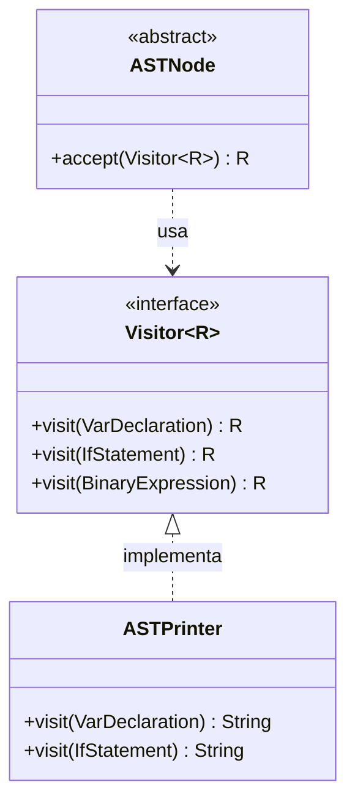
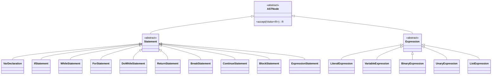

# 🦜 Quetzal STSC4J Parser

<div align="center">


**Analizador Sintáctico (Parser) del lenguaje Quetzal en español**

[Características](#-características) •
[Arquitectura](#-arquitectura) •
[Uso](#-uso) •
[Sintaxis Soportada](#-sintaxis-soportada)

</div>

---

## 📋 Descripción

**Quetzal STSC4J Parser** es el módulo de **análisis sintáctico** del compilador Quetzal. Su función es transformar una secuencia de tokens (generados por el Lexer) en un **Árbol de Sintaxis Abstracta (AST)**.

### ¿Qué es un Parser?

Un parser lee los tokens y verifica que sigan las reglas gramaticales del lenguaje. Si el código es válido, construye un árbol que representa la estructura del programa.

```
Código Fuente → [Lexer] → Tokens → [Parser] → AST
```

**Ejemplo:**
```
entero x = 5 + 3
```

El parser genera este árbol:
```
VarDeclaration
├── type: entero
├── name: x
└── value: BinaryExpression(+)
    ├── left: Literal(5)
    └── right: Literal(3)
```

---

## ✨ Características

| Característica | Descripción |
|----------------|-------------|
| 🌳 **AST Tipado** | Árbol de sintaxis con nodos específicos para cada construcción |
| 🔄 **Patrón Visitor** | Recorrido extensible del árbol para análisis y transformaciones |
| 📝 **Tipos Genéricos** | Soporte para `lista<entero>`, `lista<texto>`, etc. |
| 🎯 **Variables Mutables** | Distinción entre `var` (mutable) y constantes |
| 🔀 **Estructuras de Control** | if/else, while, for, do-while |
| 📊 **AST Printer** | Visualización del árbol para debugging |
| ⚠️ **Recuperación de Errores** | Continúa parseando después de encontrar errores |

---

## 🏗 Arquitectura

### Patrones de Diseño Utilizados

#### 1. Patrón Visitor
Permite agregar nuevas operaciones sobre el AST sin modificar las clases de los nodos.



**¿Por qué Visitor?** Permite crear diferentes "visitantes" (impresión, análisis semántico, generación de código) sin cambiar el AST.

#### 2. Parser Descendente Recursivo
Cada regla gramatical tiene un método que la implementa.

```java
// Gramática: expresión → término (('+' | '-') término)*
Expression parseTerm() {
    Expression left = parseFactor();
    while (match(PLUS, MINUS)) {
        String op = previous().getLexeme();
        Expression right = parseFactor();
        left = new BinaryExpression(left, right, op);
    }
    return left;
}
```

---

## 📊 Diagrama de Clases

### Jerarquía del AST



### Statements (Sentencias)

| Clase | Sintaxis | Descripción |
|-------|----------|-------------|
| `VarDeclaration` | `entero x = 5` | Declaración de variables |
| `IfStatement` | `si (cond) {...} sino {...}` | Condicional if/else |
| `WhileStatement` | `mientras (cond) {...}` | Bucle while |
| `ForStatement` | `para (init; cond; inc) {...}` | Bucle for |
| `DoWhileStatement` | `hacer {...} mientras (cond)` | Bucle do-while |
| `ReturnStatement` | `retornar expr` | Retorno de función |
| `BreakStatement` | `romper` | Salir de bucle |
| `ContinueStatement` | `continuar` | Siguiente iteración |
| `BlockStatement` | `{ ... }` | Bloque de código |
| `ExpressionStatement` | `expr` | Expresión como sentencia |

### Expressions (Expresiones)

| Clase | Ejemplo | Descripción |
|-------|---------|-------------|
| `LiteralExpression` | `42`, `"hola"`, `verdadero` | Valores literales |
| `VariableExpression` | `x`, `contador` | Referencias a variables |
| `BinaryExpression` | `a + b`, `x > 5` | Operaciones binarias |
| `UnaryExpression` | `!flag`, `-n` | Operaciones unarias |
| `ListExpression` | `[1, 2, 3]` | Literales de lista |

---

## 📦 Estructura del Proyecto

```
quetzal-stsc4j-parser/
├── pom.xml
├── README.md
└── src/main/java/com/stsc4j/parser/
    │
    ├── Main.java                    # Punto de entrada y demo
    │
    ├── ast/                         # Nodos del AST
    │   ├── ASTNode.java            # Clase base abstracta
    │   ├── Visitor.java            # Interface del patrón Visitor
    │   ├── ASTPrinter.java         # Imprime el AST (debugging)
    │   ├── TypeInfo.java           # Info de tipos (genéricos)
    │   │
    │   ├── expression/             # Expresiones
    │   │   ├── Expression.java     # Base de expresiones
    │   │   ├── LiteralExpression.java
    │   │   ├── VariableExpression.java
    │   │   ├── BinaryExpression.java
    │   │   ├── UnaryExpression.java
    │   │   └── ListExpression.java
    │   │
    │   └── statement/              # Sentencias
    │       ├── Statement.java      # Base de sentencias
    │       ├── VarDeclaration.java
    │       ├── IfStatement.java
    │       ├── WhileStatement.java
    │       ├── ForStatement.java
    │       ├── DoWhileStatement.java
    │       ├── ReturnStatement.java
    │       ├── BreakStatement.java
    │       ├── ContinueStatement.java
    │       ├── BlockStatement.java
    │       └── ExpressionStatement.java
    │
    ├── parser/                      # Lógica del Parser
    │   ├── Parser.java             # Parser principal
    │   ├── ParserContext.java      # Contexto (tokens, posición)
    │   ├── StatementParser.java    # Parsea sentencias
    │   ├── ExpressionParser.java   # Parsea expresiones
    │   └── DeclarationParser.java  # Parsea declaraciones
    │
    └── exception/
        └── ParseException.java     # Errores de parsing
```

---

## 🎯 Sintaxis Soportada

### Tipos de Datos

```
entero      → int, long, short
número      → double, float  
texto       → String
log         → boolean
lista<T>    → Lista genérica
```

### Declaración de Variables

```javascript
// Constante (inmutable)
entero edad = 25

// Variable mutable
entero var contador = 0

// Lista tipada
lista<entero> numeros = [1, 2, 3]

// Lista de textos
lista<texto> nombres = ["Ana", "Luis"]
```

### Estructuras de Control

```javascript
// Condicional
si (x > 10) {
    // código
} sino {
    // código
}

// Bucle while
mientras (x < 100) {
    x = x + 1
}

// Bucle for
para (entero i = 0; i < 10; i = i + 1) {
    // código
}

// Bucle do-while
hacer {
    // código
} mientras (condicion)

// Control de flujo
romper      // break
continuar   // continue
retornar x  // return
```

### Expresiones

```javascript
// Aritméticas
a + b, a - b, a * b, a / b, a % b

// Comparación
a < b, a > b

// Lógicas
a && b, a || b, !a

// Unarias
-x, !flag

// Listas
[1, 2, 3]
[x, y, z]
[]  // lista vacía
```

---

## 💻 Uso

### Ejemplo Completo

```java
import com.stsc4j.lexer.LexerContext;
import com.stsc4j.parser.ast.ASTPrinter;
import com.stsc4j.parser.ast.statement.Statement;
import com.stsc4j.parser.parser.Parser;

import java.util.List;

public class Main {
    public static void main(String[] args) {
        String codigo = "lista<entero> nums = [1, 2, 3]";
        
        // 1. Análisis Léxico
        LexerContext lexer = new LexerContext();
        lexer.process(codigo);
        
        // 2. Análisis Sintáctico
        Parser parser = new Parser(lexer.getTokens());
        List<Statement> ast = parser.parse();
        
        // 3. Imprimir AST
        ASTPrinter printer = new ASTPrinter();
        for (Statement stmt : ast) {
            System.out.println(printer.print(stmt));
        }
        
        // 4. Verificar errores
        if (!parser.getErrors().isEmpty()) {
            System.out.println("Errores:");
            parser.getErrors().forEach(System.out::println);
        }
    }
}
```

### Salida del ASTPrinter

```
VarDeclaration:
  type: lista<entero>
  name: nums
  mutable: false
  value:
    ListExpression:
      [0]:
        Literal(Integer): 1
      [1]:
        Literal(Integer): 2
      [2]:
        Literal(Integer): 3
```

---

## 🔧 Precedencia de Operadores

De menor a mayor precedencia:

| Nivel | Operadores | Asociatividad |
|-------|------------|---------------|
| 1 | `\|\|` (OR) | Izquierda |
| 2 | `&&` (AND) | Izquierda |
| 3 | `<`, `>` | Izquierda |
| 4 | `+`, `-` | Izquierda |
| 5 | `*`, `/`, `%` | Izquierda |
| 6 | `!`, `-` (unarios) | Derecha |
| 7 | Literales, variables, `()` | - |

---

## ⚠️ Manejo de Errores

El parser implementa **recuperación de errores** para continuar analizando después de un error:

```java
// Si encuentra un error, registra el mensaje
errors.add("Se esperaba ';' en línea 5");

// Sincroniza avanzando hasta un punto seguro
synchronize(); // Avanza hasta encontrar un nuevo statement

// Continúa parseando el resto del código
```

---

## 🚀 Instalación

```xml
<dependency>
    <groupId>com.stsc4j</groupId>
    <artifactId>quetzal-stsc4j-parser</artifactId>
    <version>0.0.1</version>
</dependency>
```

```bash
mvn clean install
```

---

## 📄 Licencia

MIT License - Ver archivo `LICENSE`

---

<div align="center">

**Quetzal STSC4J** - Compilador Source-to-Source para Java

[⬆ Volver arriba](#-quetzal-stsc4j-parser)

</div>
